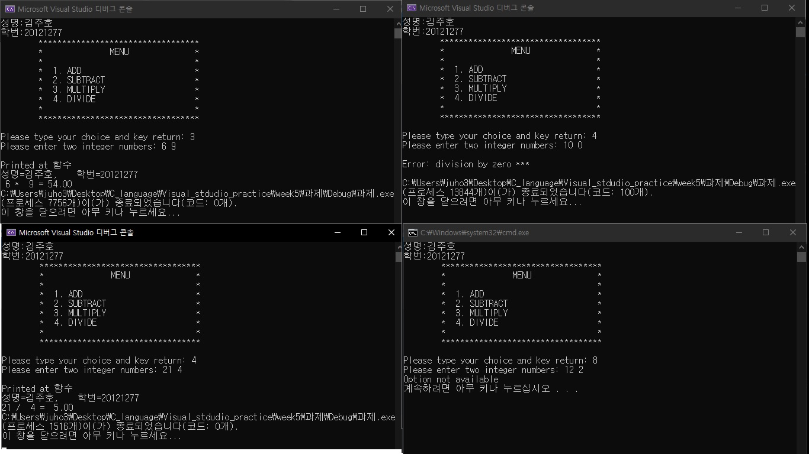
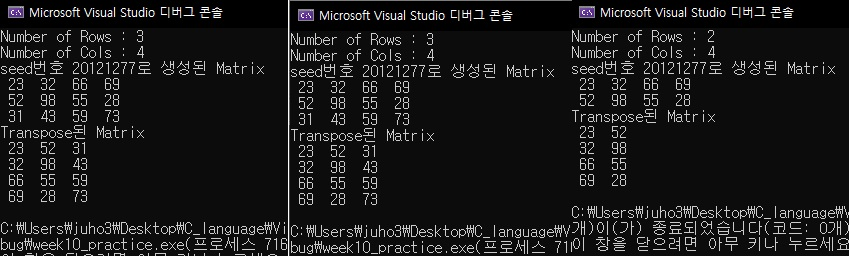

# Learning C language in 2020-1 semester

- Learn C language basic concept in 2020-1 semester

- Write serveral elementary algorithm codes in c language.

- calculator assignment

  

- transpose matrix practice

  

